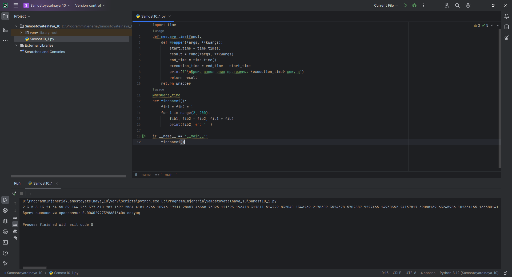

# Тема 10. Декораторы и исключения
Отчет по Теме #10 выполнил(а):
- Еличкин Владислав Евгеньевич
- ЗПИЭ-20-1

| Задание    | Сам_раб |
|------------|---------|
| Задание 1  |    +    |
| Задание 2  |    +    |
| Задание 3  |    +    |
| Задание 4  |    +    |
| Задание 5  |    +    |

знак "+" - задание выполнено; знак "-" - задание не выполнено;

Работу проверили:
- к.э.н., доцент Панов М.А.

## Самостоятельная работа №1
### Вовочка решил заняться спортивным программированием на python, но для этого он должен знать за какое время выполняется его программа. Он решил, что для этого ему идеально подойдет декоратор для функции, который будет выяснять за какое время выполняется та или иная функция. Помогите Вовочке в его начинаниях и напишите такой декоратор.

```python
import time
def mesuare_time(func):
    def wrapper(*args, **kwargs):
        start_time = time.time()
        result = func(*args, **kwargs)
        end_time = time.time()
        execution_time = end_time - start_time
        print(f'\nВремя выполнения программы: {execution_time} секунд')
        return result
    return wrapper
@mesuare_time
def fibonacci():
    fib1 = fib2 = 1
    for i in range(2, 200):
        fib1, fib2 = fib2, fib1 + fib2
        print(fib2, end=' ')

if __name__ == '__main__':
    fibonacci()
```

### Результат.



## Выводы

С помощью функции `mesuare_time()` в виде декоратора можно замерять время выполнения других функций.
