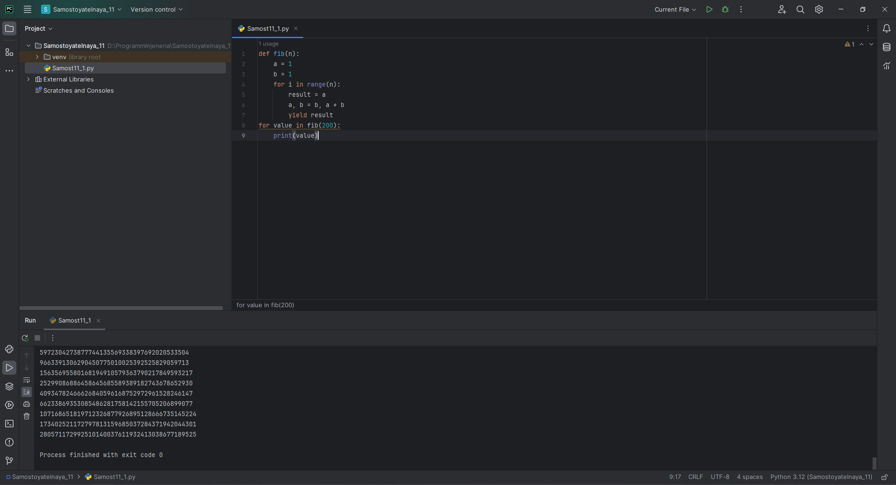
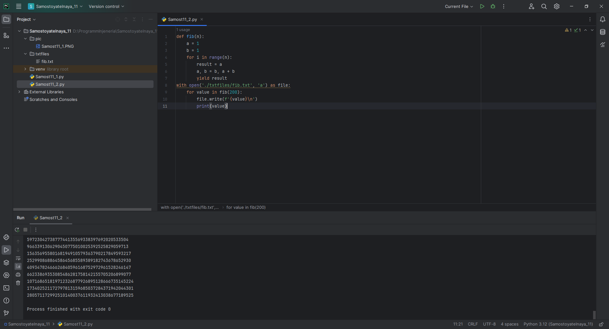
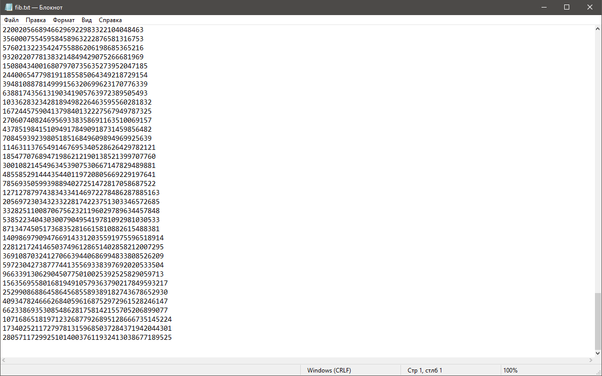

# Тема 11. Итераторы и генераторы
Отчет по Теме #11 выполнил(а):
- Еличкин Владислав Евгеньевич
- ЗПИЭ-20-1

| Задание    | Сам_раб |
|------------|---------|
| Задание 1  |    +    |
| Задание 2  |    +    |

знак "+" - задание выполнено; знак "-" - задание не выполнено;

Работу проверили:
- к.э.н., доцент Панов М.А.

## Самостоятельная работа №1
### Вас никак не могут оставить числа Фибоначчи, очень уж они вас заинтересовали. Изучив новые возможности Python вы решили реализовать программу, которая считает числа Фибоначчи при помощи итераторов. Расчет начинается с чисел 1 и 1. Создайте функцию fib(n), генерирующую n чисел Фибоначчи с минимальными затратами ресурсов. Для реализации этой функции потребуется обратиться к инструкции yield (Она не сохраняет в оперативной памяти огромную последовательность, а дает возможность “доставать” промежуточные результаты по одному). Результатом решения задачи будет листинг кода и вывод в консоль с числом Фибоначчи от 200.

```python
def fib(n):
    a = 1
    b = 1
    for i in range(n):
        result = a
        a, b = b, a + b
        yield result
for value in fib(200):
    print(value)
```

### Результат.



## Выводы

В данном задании, при помощи генераторов можгно написать более эффективную функцию для расчёта числа Фибоначи.

## Самостоятельная работа №2
### К коду предыдущей задачи добавьте запоминание каждого числа Фибоначчи в файл “fib.txt”, при этом каждое число должно находиться на отдельной строчке. Результатом выполнения задачи будет листинг кода и скриншот получившегося файла.

```python
def fib(n):
    a = 1
    b = 1
    for i in range(n):
        result = a
        a, b = b, a + b
        yield result
with open('./txtfiles/fib.txt', 'a') as file:
    for value in fib(200):
        file.write(f'{value}\n')
        print(value)
```

### Результат.




## Выводы

В данном задании, я добавил запись числа Фибоначи в текстовый файл fib.txt.

## Общий вывод по самостоятельной работе №11

В Python генераторы и итераторы представляют собой инструменты, которые используются для обработки данных. Основное назначение итераторов - это упрощение навигации по элементам объекта, который может представлять собой некоторую коллекцию, например список, словарь и т.п., а генераторы позволяют значительно упростить работу по конструированию итераторов. 
