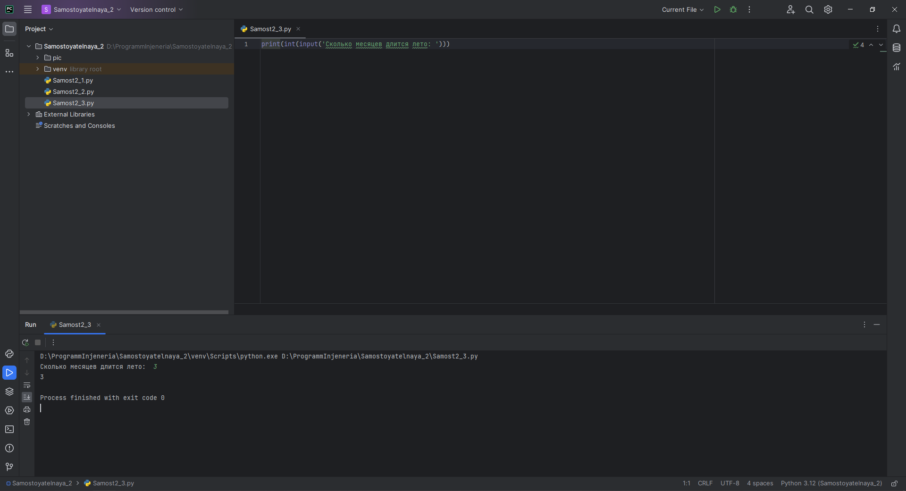
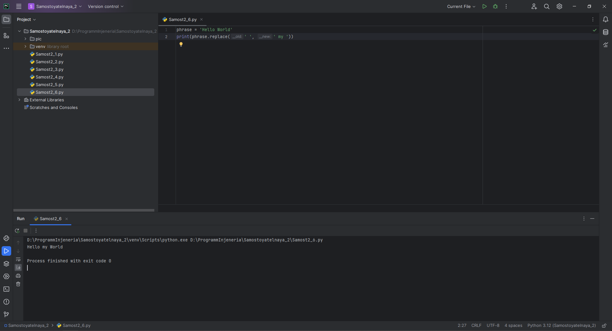

# Тема 2. Базовые операции языка Python
Отчет по Теме #2 выполнил(а):
- Еличкин Владислав Евгеньевич
- ЗПИЭ-20-1

| Задание    | Сам_раб |
|------------|---------|
| Задание 1  |    +    |
| Задание 2  |    +    |
| Задание 3  |    +    |
| Задание 4  |    +    |
| Задание 5  |    +    |
| Задание 6  |    +    |
| Задание 7  |    +    |
| Задание 8  |    +    |
| Задание 9  |    +    |
| Задание 10 |    +    |

знак "+" - задание выполнено; знак "-" - задание не выполнено;

Работу проверили:
- к.э.н., доцент Панов М.А.

## Самостоятельная работа №1
### Выведите в консоль булевую переменную False, не используя слово False в строке или изначально присвоенную булевую переменную. Программа должна занимать не более двух строк редактора кода.

```python
print(bool(0))
```

### Результат.


## Выводы

В представленном решении, я преобразовал число `0` к булевому значению `False`, при помощи функции `bool(0)`.

## Самостоятельная работа №2
### Присвоить значения трем переменным и вывести их в консоль, используя только две строки редактора кода.

```python
one = 8; two = 7; three = 6
print(one, two, three)
```

### Результат.


## Выводы

Перед тем, как объявить переменные в одну строку, их нужно разделить между собой. Разделяются они `;`. Далее выводятся в консоль в соответствующем порядке.

## Самостоятельная работа №3
### Реализуйте ввод данных в программу, через консоль, в виде только целых чисел (тип данных int). То есть при вводе буквенных символов в консоль, программа не должна работать. Программа должна занимать не более двух строк редактора кода.

```python
print(int(input('Сколько месяцев длится лето: ')))
```

### Результат.



## Выводы

Чтобы реализовать ввод данных в программу только в виде чисел, я использовал функцию `input()` и обернул её в `int()`: `int(input())`.

## Самостоятельная работа №4
### Создайте только одну строковую переменную. Длина строки должна не превышать 5 символов. На выходе мы должны получить строку длиной не менее 16 символов. Программа должна занимать не более двух строк редактора кода.

```python
str = "james"
print(str, str, str, str, sep='')
```

### Результат.


## Выводы

Функция `print()` позволяет передавать более одной переменной, поэтому  у меня получилось из строки в 5 символов, получить строку в 20 символов.

## Самостоятельная работа №5
### Создайте три переменные: день (тип данных - числовой), месяц (тип данных - строка), год (тип данных - числовой) и выведите в консоль текущую дату в формате: “Сегодня день месяц год. Всего хорошего!” используя F строку и оператор end внутри print(), в котором вы должны написать фразу “Всего хорошего!”. Программа должна занимать не более двух строк редактора кода.

```python
day = 24; month = 'сентября'; year = 2023
print(f'Сегодня {day} {month} {year}. ', end='Всего хорошего!')
```

### Результат.


## Выводы

Я использовал `f-строку`, чтобы вывести значение переменной и аргумент `end` для вывода фразы из условия.

## Самостоятельная работа №6
### В предложении ‘Hello World’ вставьте ‘my’ между двумя словами. Выведите полученное предложение в консоль в одну строку. Программа должна занимать не более двух строк редактора кода.

```python
phrase = 'Hello World'
print(phrase.replace(" ", ' my '))
```

### Результат.



## Вывод

Я использовал функцию `replace`, чтобы получилось вставить между словами `my`. Также призвел замену пробела - ` my `.

## Самостоятельная работа №7
### Узнайте длину предложения ‘Hello World’, результат выведите в консоль. Программа должна занимать не более двух строк редактора кода.

```python
print(len('Hello World'))
```

### Результат.


## Выводы

Для того, чтобы узнать длину строки, я использовал функцию `len()`.

## Самостоятельная работа №8
### Переведите предложение ‘HELLO WORLD’ в нижний регистр. Программа должна занимать не более двух строк редактора кода.

```python
print('HELLO WORLD'.lower())
```

### Результат.


## Выводы

Я использовал функцию `lower()`, чтобы изменить регистр у строки.

## Самостоятельная работа №9
### Самостоятельно придумайте задачу по проходимой теме и решите ее. Задача должна быть связанна со взаимодействием с числовыми значениями.
### Присвоить значения трем переменным и вывести их в консоль в обратном порядке, используя только две строки редактора кода.

```python
one = 50; two = 100; three = 150
print(three, two, one)
```

### Результат.


## Выводы

Перед тем, как объявить переменные в одну строку, я их разделил между собой `;`. Далее вывел в консоль в обратном порядке.

## Самостоятельная работа №10
### Самостоятельно придумайте задачу по проходимой теме и решите ее. Задача должна быть связанна со взаимодействием со строковыми значениями.
### Переведите предложение ‘hi! my name is vladislav, i am a ui/ux graphic designer’ в верхний регистр. Программа должна занимать не более двух строк редактора кода.

```python
print('hi! my name is vladislav, i am a ui/ux graphic designer'.upper())
```

### Результат.


## Выводы

Чтобы преобразовать строку к верхнему регистру, я использовал функцию `upper()`.

## Общий вывод по самостоятельной работе №2

1. Функция `print()` используется для вывода информации на экран или в консоль.
2. `bool()` - это логический тип переменных, который имеет два значения: True (истина) и False (ложь).
3. Методы `lower()` и `upper()` позволяют изменять регистр символов в строке. Метод `lower()` преобразует все символы строки в нижний регистр, а метод `upper()` делает все символы строки заглавными.
4. Метод `len()` - встроенный метод Python для нахождения длины списка.
