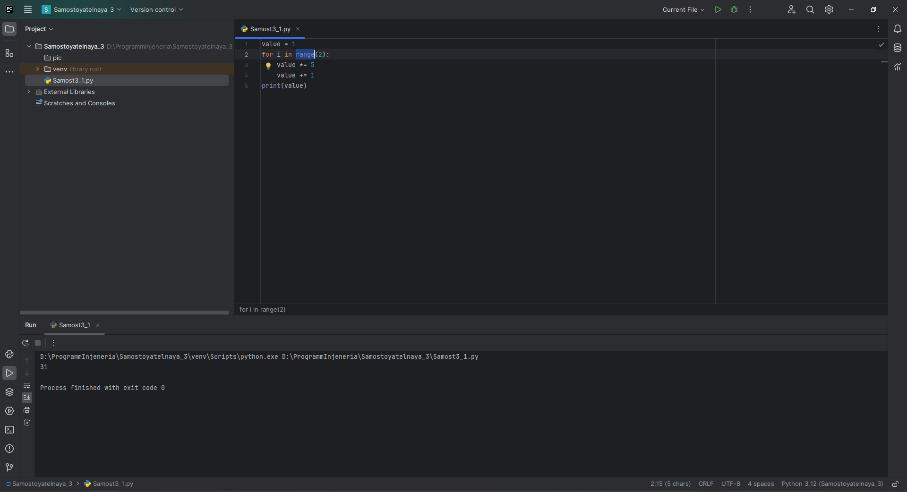
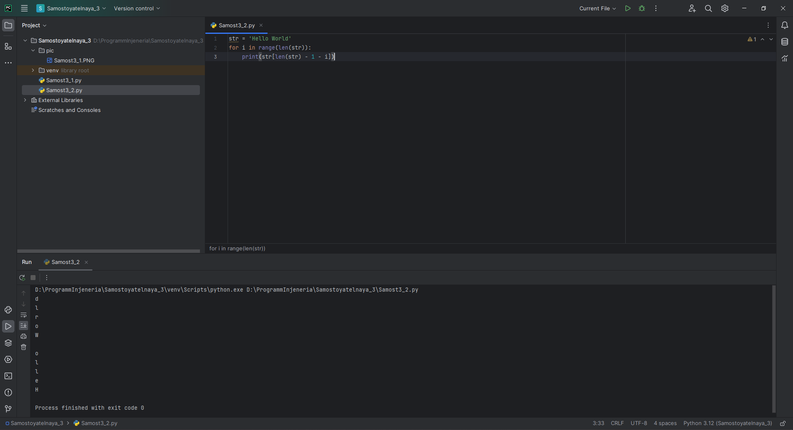

# Тема 3. Операторы, условия, циклы
Отчет по Теме #3 выполнил(а):
- Еличкин Владислав Евгеньевич
- ЗПИЭ-20-1

| Задание    | Сам_раб |
|------------|---------|
| Задание 1  |    +    |
| Задание 2  |    +    |
| Задание 3  |    +    |
| Задание 4  |    +    |
| Задание 5  |    +    |

знак "+" - задание выполнено; знак "-" - задание не выполнено;

Работу проверили:
- к.э.н., доцент Панов М.А.

## Самостоятельная работа №1
### Напишите программу, которая преобразует 1 в 31. Для выполнения поставленной задачи необходимо обязательно и только один раз использовать: цикл for, *=5, +=1. Никаких других действий или циклов использовать нельзя.

```python
value = 1
for i in range(2):
    value *= 5
    value += 1
print(value)
```

### Результат.


## Выводы

В данном задании, я два раза запустил цикл `for`, для того, чтобы использовав математические расчеты, получить из числа 1, число 31.

## Самостоятельная работа №2
### Напишите программу, которая фразу «Hello World» выводит в обратном порядке, и каждая буква находится в одной строке консоли.

```python
str = 'Hello World'
for i in range(len(str)):
    print(str[len(str) - 1 - i])
```

### Результат.


## Выводы

В данном задании, я использовал цикл `for` и функцию `range()`, чтобы вывести каждую букву отдельно. Далее я вычитал из длины слова текущий индекс.
