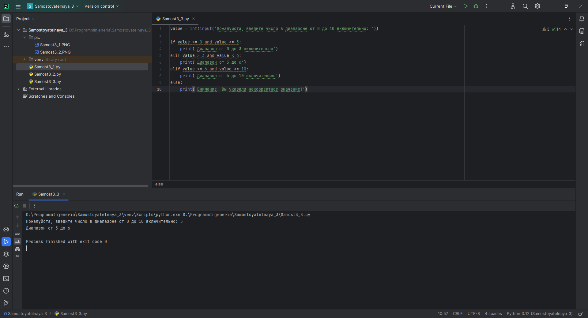
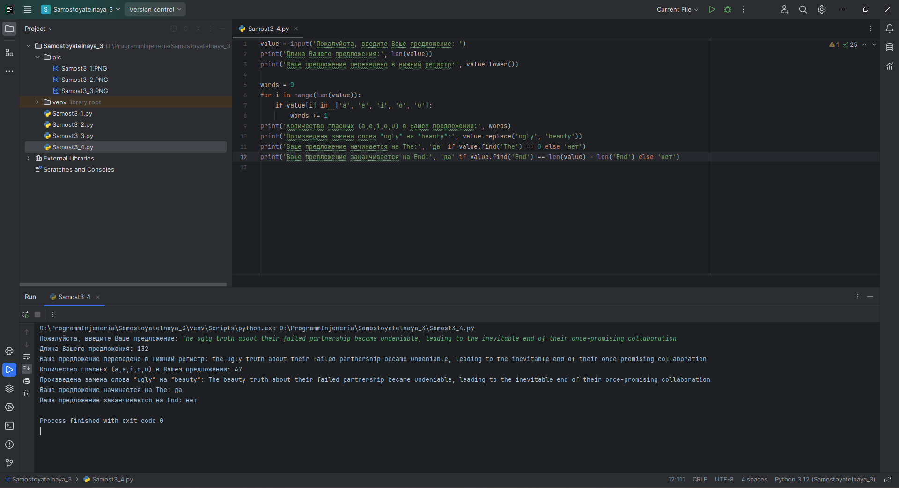

# Тема 3. Операторы, условия, циклы
Отчет по Теме #3 выполнил(а):
- Еличкин Владислав Евгеньевич
- ЗПИЭ-20-1

| Задание    | Сам_раб |
|------------|---------|
| Задание 1  |    +    |
| Задание 2  |    +    |
| Задание 3  |    +    |
| Задание 4  |    +    |
| Задание 5  |    +    |

знак "+" - задание выполнено; знак "-" - задание не выполнено;

Работу проверили:
- к.э.н., доцент Панов М.А.

## Самостоятельная работа №1
### Напишите программу, которая преобразует 1 в 31. Для выполнения поставленной задачи необходимо обязательно и только один раз использовать: цикл for, *=5, +=1. Никаких других действий или циклов использовать нельзя.

```python
value = 1
for i in range(2):
    value *= 5
    value += 1
print(value)
```

### Результат.


## Выводы

В данном задании, я два раза запустил цикл `for`, для того, чтобы использовав математические расчеты, получить из числа 1, число 31.

## Самостоятельная работа №2
### Напишите программу, которая фразу «Hello World» выводит в обратном порядке, и каждая буква находится в одной строке консоли.

```python
str = 'Hello World'
for i in range(len(str)):
    print(str[len(str) - 1 - i])
```

### Результат.


## Выводы

В данном задании, я использовал цикл `for` и функцию `range()`, чтобы вывести каждую букву отдельно. Далее я вычитал из длины слова текущий индекс.

## Самостоятельная работа №3
### Напишите программу, на вход которой поступает значение из консоли, оно должно быть числовым и в диапазоне от 0 до 10 включительно (это необходимо учесть в программе). Если вводимое число не подходит по требованиям, то необходимо вывести оповещение об этом в консоль и остановить программу. Код должен вычислять в каком диапазоне находится полученное число. Нужно учитывать три диапазона: от 0 до 3 включительно; от 3 до 6; от 6 до 10 включительно. Результатом работы программы будет выведенный в консоль диапазон.

```python
value = int(input('Пожалуйста, введите число в диапазоне от 0 до 10 включительно: '))

if value >= 0 and value <= 3:
    print('Диапазон от 0 до 3 включительно')
elif value > 3 and value < 6:
    print('Диапазон от 3 до 6')
elif value >= 6 and value <= 10:
    print('Диапазон от 6 до 10 включительно')
else:
    print('Внимание! Вы указали некорректное значение!')
```

### Результат.


## Выводы

В данном задании, я использовал оператор `if` для проверки условия и выполнения кода, если условие истинно. Команду `elif` для проверки истинности выражений и `else`, как итог, что если ни одно из вышестоящих условий не сработало, то будет выполнено действие, стоящее после `else`.

## Самостоятельная работа №4
### Манипулирование строками. Напишите программу на Python, которая принимает предложение (на английском) в качестве входных данных от пользователя.

```python
value = input('Пожалуйста, введите Ваше предложение: ')
print('Длина Вашего предложения:', len(value))
print('Ваше предложение переведено в нижний регистр:', value.lower())

words = 0
for i in range(len(value)):
    if value[i] in  ['a', 'e', 'i', 'o', 'u']:
        words += 1
print('Количество гласных (a,e,i,o,u) в Вашем предложении:', words)
print('Произведена замена слова "ugly" на "beauty":', value.replace('ugly', 'beauty'))
print('Ваше предложение начинается на The:', 'да' if value.find('The') == 0 else 'нет')
print('Ваше предложение заканчивается на End:', 'да' if value.find('End') == len(value) - len('End') else 'нет')
```

### Результат.


## Выводы

В данном задании, я использовал функцию `len()`, чтобы узнать длину предложения. Функцией `lower()`, я перевел предложение в нижний регситр. Функцией `replace()`, я заменил одну подстроку на другую. Чтобы проверить начинается ли строка на определённую подстроку, то можно воспользоваться функцие `find()` для получения индекса начала подстроки и сравнить полученное значение с 0.
