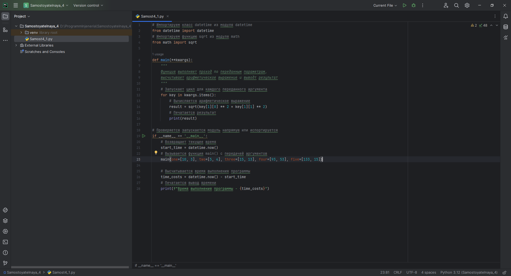

# Тема 4. Функции и модули
Отчет по Теме #4 выполнил(а):
- Еличкин Владислав Евгеньевич
- ЗПИЭ-20-1

| Задание    | Сам_раб |
|------------|---------|
| Задание 1  |    +    |
| Задание 2  |    +    |
| Задание 3  |    +    |
| Задание 4  |    +    |
| Задание 5  |    +    |

знак "+" - задание выполнено; знак "-" - задание не выполнено;

Работу проверили:
- к.э.н., доцент Панов М.А.

## Самостоятельная работа №1
### Дайте подробный комментарий для кода, написанного ниже. Комментарий нужен для каждой строчки кода, нужно описать что она делает. Не забудь те, что функции комментируются по-особенному.

```python
# Производим импортирование класса datetime из модуля datetime
from datetime import datetime
# Производим импортирование функции sqrt из модуля math
from math import sqrt

def main(**kwargs):
    """
    Теперь наша функция выполняет свой проход по переданным параметрам,
    и высчитывает арифметическое выражение, а также выводит  свой результат
    """
    # Далее запускаем цикл для каждого переданного аргумента
    for key in kwargs.items():
        # И вычисляем арифметическое выражение
        result = sqrt(key[1][0] ** 2 + key[1][1] ** 2)
        # После печатаем результат
        print(result)

# Дальше проверяем и запускаем модуль
if __name__ == '__main__':
    # И возвращаем текущее время
    start_time = datetime.now()
    # Просиходит вызов функции main() с передачей аргументов
    main(one=[10, 3], two=[5, 4], three=[15, 13], four=[93, 53], five=[133, 15])

    # Просходит высчитывание времени, которое необходимо для выполнения программы
    time_costs = datetime.now() - start_time
    # В конце печатается вывод времени
    print(f"Время выполнения программы - {time_costs}")
```

### Результат.



## Выводы

В данном задании, я написал комментарии к коду.

## Самостоятельная работа №2
### Напишите программу, которая будет заменять игральную кость с 6 гранями. Если значение равно 5 или 6, то в консоль выводится «Вы победили», если значения 3 или 4, то вы рекурсивно должны вызвать эту же функцию, если значение 1 или 2, то в консоль выводится «Вы проиграли». При этом каждый вызов функции необходимо выводить в консоль значение “кубика”. Для выполнения задания необходимо использовать стандартную библиотеку random. Программу нужно написать, используя одну функцию и "точку входа".

```python
from random import randint
def roll():
    result = randint(1, 6)
    print('Значение кубика: ', result)
    if result == 3 or result == 4:
        return roll()
    return result;
def main():
    value = roll()
    if value == 5 or value == 6:
        print('Вы победили')
    elif value == 1 or value == 2:
        print('Вы проиграли')
if __name__ == '__main__':
    main()
```

### Результат.


## Выводы

В данном задании, я использовал функцию `randint()`, которая при указанном диапазоне значений может генерировать случаное число.

## Самостоятельная работа №3
### Напишите программу, которая будет выводить текущее время, с точностью до секунд на протяжении 5 секунд. Программу нужно написать с использованием цикла. Подсказка: необходимо использовать модуль datetime и time, а также вам необходимо как-то “усыплять” программу на 1 секунду.

```python
from datetime import datetime
from time import sleep

for i in range(5):
    date = datetime.now()
    print(date.time().replace(microsecond=0))
    sleep(1)
```

### Результат.


## Выводы

В данном задании, я использовал функцию `sleep()`, которая приостанавливает или ожидает выполнение текущего потока на указанное количество секунд. 
Функция `time()`, позволяет отображать время.

## Самостоятельная работа №4
### Напишите программу, которая считает среднее арифметическое от аргументов вызываемое функции, с условием того, что изначальное количество этих аргументов неизвестно. Программу необходимо реализовать используя одну функцию и “точку входа”.

```python
def calc(*numbers):
    countNumbers = len((numbers))
    result = 0;
    for i in range(countNumbers):
        result += numbers[i]

    return result / countNumbers
def main():
    print('Для чисел 8, 7, 6 среднее арифметическое будет равно:', calc(8, 7, 6))
if __name__ == '__main__':
    main()
```

### Результат.


## Выводы

В данном задании, я поставил `*` рядом с функцией, чтобы она принимала неизвестное количество аргументов.

## Самостоятельная работа №5
### Создайте два Python файла, в одном будет выполняться вычисление площади треугольника при помощи формулы Герона (необходимо реализовать через функцию), а во втором будет происходить взаимодействие с пользователем (получение всей необходимой информации и вывод результатов). Напишите эту программу и выведите в консоль полученную площадь.

```python
# Samost4_5Calculation_1.py
from math import sqrt
def calc_truangle_square_gerone_calc(a, b, c):
    p = (a + b + c) / 2
    return sqrt(p * (p - a) * (p - b) * (p - c))

# Samost4_5Calculation_2.py
from Samost4_5_Сalculation_1 import calc_truangle_square_gerone_calc

a = int(input('Введите сторону треугольника а: '))
b = int(input('Введите сторону треугольника b: '))
c = int(input('Введите сторону треугольника c: '))

print('S =', calc_truangle_square_gerone_calc(a, b, c))
```

### Результат.


## Выводы

Модульность в Python позволяет разделить программу на отдельные компоненты, которые называются модулями.

## Общий вывод по самостоятельной работе №4

1. `datetime` - важный элемент любой программы, написанной на Python. Этот модуль позволяет управлять датами и временем.
2. `math` - один из наиважнейших модулей в Python. Он предоставляет обширный функционал для проведения вычислений с числами.
3. Также в Python есть возможность написать свой модуль.
