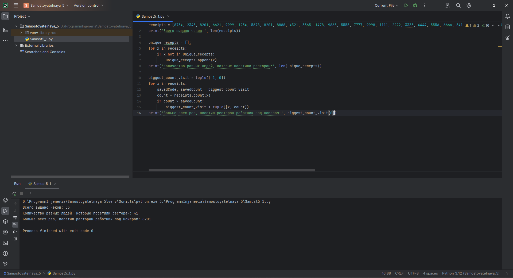
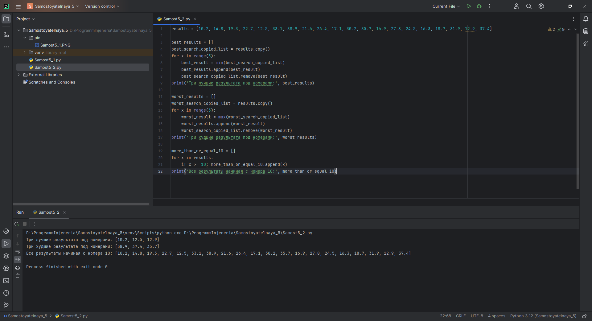
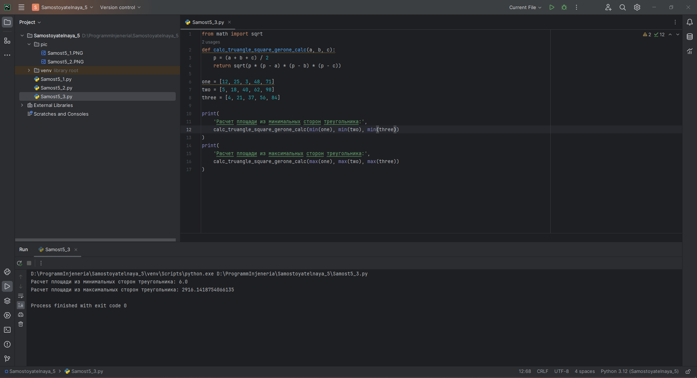
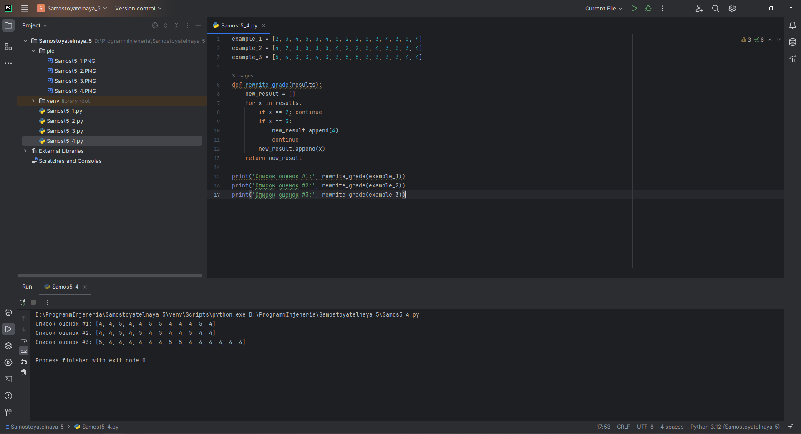
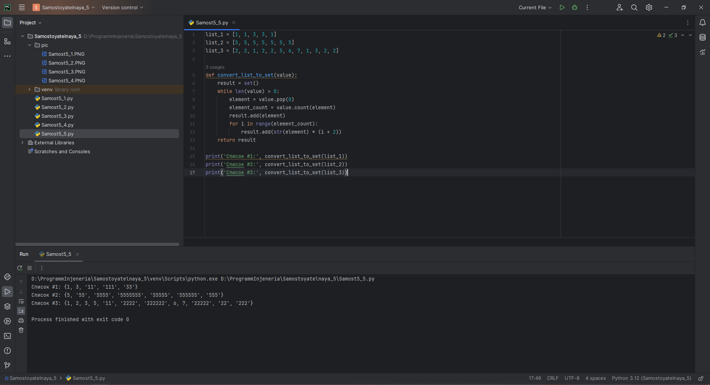

# Тема 5. Базовые коллекции: множества, списки
Отчет по Теме #5 выполнил(а):
- Еличкин Владислав Евгеньевич
- ЗПИЭ-20-1

| Задание    | Сам_раб |
|------------|---------|
| Задание 1  |    +    |
| Задание 2  |    +    |
| Задание 3  |    +    |
| Задание 4  |    +    |
| Задание 5  |    +    |

знак "+" - задание выполнено; знак "-" - задание не выполнено;

Работу проверили:
- к.э.н., доцент Панов М.А.

## Самостоятельная работа №1
### Ресторан на предприятии ведет учет посещений за неделю при помощи кода работника. У них есть список со всеми посещениями за неделю. Посчитать: сколько выдано чеков, сколько разных людей посетило ресторан, какой работник посетил ресторан больше всех раз.

```python
receipts = [8734, 2345, 8201, 6621, 9999, 1234, 5678, 8201, 8888, 4321, 3365, 1478, 9865, 5555, 7777, 9998, 1111, 2222, 3333, 4444, 5556, 6666, 5410, 7778, 8889, 4445, 1439, 9604, 8201, 3365, 7502, 3016, 4928, 5837, 8201, 2643, 5017, 9682, 8530, 3250, 7193, 9051, 4506, 1987, 3365, 5410, 7168, 7777, 9865, 5678, 8201, 4445, 3016, 4506, 4506]
print('Всего выдано чеков:', len(receipts))

unique_recepts = [];
for x in receipts:
    if x not in unique_recepts:
        unique_recepts.append(x)
print('Количество разных людей, которые посетили ресторан:', len(unique_recepts))

biggest_count_visit = tuple([-1, 0])
for x in receipts:
    savedCode, savedCount = biggest_count_visit
    count = receipts.count(x)
    if count > savedCount:
        biggest_count_visit = tuple([x, count])
print('Больше всех раз, посетил ресторан работник под номером:', biggest_count_visit[0])
```

### Результат.



## Выводы

В данном задании, я использовал функцию `len()`, чтобы количество всех чеков. Чтобы посчитать разных людей, нужно завести уникальный список и добавлять в него код сотрудника. Чтобы определить того сотрудника, который посещал ресторан больше всего раз, необходимо посчитать сколько раз каждый сотрудник был на работе и сравнивать результат с ранее сохранённым.

## Самостоятельная работа №2
### На физкультуре студенты сдавали бег, у преподавателя физкультуры есть список всех результатов, ему нужно узнать: три лучшие результата, три худшие результата, все результаты начиная с 10.

```python
results = [10.2, 14.8, 19.3, 22.7, 12.5, 33.1, 38.9, 21.6, 26.4, 17.1, 30.2, 35.7, 16.9, 27.8, 24.5, 16.3, 18.7, 31.9, 12.9, 37.4]

best_results = []
best_search_copied_list = results.copy()
for x in range(3):
    best_result = min(best_search_copied_list)
    best_results.append(best_result)
    best_search_copied_list.remove(best_result)
print('Три лучшие результата под номерами:', best_results)

worst_results = []
worst_search_copied_list = results.copy()
for x in range(3):
    worst_result = max(worst_search_copied_list)
    worst_results.append(worst_result)
    worst_search_copied_list.remove(worst_result)
print('Три худшие результата под номерами:', worst_results)

more_than_or_equal_10 = []
for x in results:
    if x >= 10: more_than_or_equal_10.append(x)
print('Все результаты начиная с номера 10:', more_than_or_equal_10)
```

### Результат.



## Выводы

В данном задании, я использовал функцию `min()`, чтобы найти три лучших результата. Далее использовал функцию `max()`, чтобы найти три худших результата. В конце при помощи сравнения выписать результаты, которые `>10`.

## Самостоятельная работа №3
### Преподаватель по математике придумал странную задачку. У вас есть три списка с элементами, каждый элемент которых – длина стороны треугольника, ваша задача найти площади двух треугольников, составленные из максимальных и минимальных элементов полученных списков. Результатом выполнения задачи будет: листинг кода, и вывод в консоль, в котором будут указаны два этих значения.

```python
from math import sqrt
def calc_truangle_square_gerone_calc(a, b, c):
    p = (a + b + c) / 2
    return sqrt(p * (p - a) * (p - b) * (p - c))

one = [12, 25, 3, 48, 71]
two = [5, 18, 40, 62, 98]
three = [4, 21, 37, 56, 84]

print(
    'Расчет площади из минимальных сторон треугольника:',
    calc_truangle_square_gerone_calc(min(one), min(two), min(three))
)
print(
    'Расчет площади из максимальных сторон треугольника:',
    calc_truangle_square_gerone_calc(max(one), max(two), max(three))
)
```

### Результат.



## Выводы

В данном задании, я воспользовался формулой Герона, чтобы найти площадь треугольника. `min()` и `max()` - функции, которые помогли найти минимальное и максимальное значение.

## Самостоятельная работа №4
### Никто не любит получать плохие оценки, поэтому Борис решил это исправить. Допустим, что все оценки студента за семестр хранятся в одном списке. Ваша задача удалить из этого списка все двойки, а все тройки заменить на четверки.

```python
example_1 = [2, 3, 4, 5, 3, 4, 5, 2, 2, 5, 3, 4, 3, 5, 4]
example_2 = [4, 2, 3, 5, 3, 5, 4, 2, 2, 5, 4, 3, 5, 3, 4]
example_3 = [5, 4, 3, 3, 4, 3, 3, 5, 5, 3, 3, 3, 3, 4, 4]

def rewrite_grade(results):
    new_result = []
    for x in results:
        if x == 2: continue
        if x == 3:
            new_result.append(4)
            continue
        new_result.append(x)
    return new_result

print('Список оценок #1:', rewrite_grade(example_1))
print('Список оценок #2:', rewrite_grade(example_2))
print('Список оценок #3:', rewrite_grade(example_3))
```

### Результат.



## Выводы

В данном задании, я сначала проверил каждый элемент, пробежавшись по списку. Если элементом является `2`, то в мой новый список он не попадает. Если элементом является `3`, то его мы заменяем на`4` и уже помещаем его в список.

## Самостоятельная работа №5
### Вам предоставлены списки натуральных чисел, из них необходимо сформировать множества. При этом следует соблюдать это правило: если какое-либо число повторяется, то преобразовать его в строку по следующему образцу: например, если число 4 повторяется 3 раза, то в множестве будет следующая запись: само число 4, строка «44», строка «444».

```python
list_1 = [1, 1, 3, 3, 1]
list_2 = [5, 5, 5, 5, 5, 5, 5]
list_3 = [2, 2, 1, 2, 2, 5, 6, 7, 1, 3, 2, 2]

def convert_list_to_set(value):
    result = set()
    while len(value) > 0:
        element = value.pop(0)
        element_count = value.count(element)
        result.add(element)
        for i in range(element_count):
            result.add(str(element) * (i + 2))
    return result

print('Список #1:', convert_list_to_set(list_1))
print('Список #2:', convert_list_to_set(list_2))
print('Список #3:', convert_list_to_set(list_3))
```

### Результат.



## Выводы

В данном задании я сформировал список во множество путем итерации по списку и проделал необходимые действия над каждым из элементов.

## Общий вывод по самостоятельной работе №5

В Python `list` - упорядоченный изменяемый набор объектов произвольных типов, пронумерованных от 0. Он используется для хранения и работы с данными.
