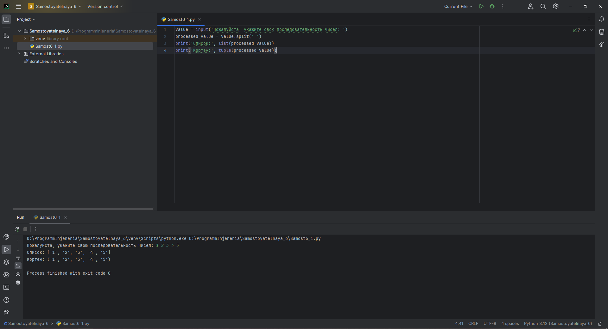

# Тема 6. Базовые коллекции: словари, кортежи
Отчет по Теме #6 выполнил(а):
- Еличкин Владислав Евгеньевич
- ЗПИЭ-20-1

| Задание    | Сам_раб |
|------------|---------|
| Задание 1  |    +    |
| Задание 2  |    +    |
| Задание 3  |    +    |
| Задание 4  |    +    |
| Задание 5  |    +    |

знак "+" - задание выполнено; знак "-" - задание не выполнено;

Работу проверили:
- к.э.н., доцент Панов М.А.

## Самостоятельная работа №1
### При создании сайта у вас возникла потребность обрабатывать данные пользователя в странной форме, а потом переводить их в нужные вам форматы. Вы хотите принимать от пользователя последовательность чисел, разделенных пробелом, а после переформатировать эти данные в список и кортеж. Реализуйте вашу задумку. Для получения начальных данных используйте input(). Результатом программы будет выведенный список и кортеж из начальных данных.

```python
value = input('Пожалуйста, укажите свою последовательность чисел: ')
processed_value = value.split(' ')
print('Список:', list(processed_value))
print('Кортеж:', tuple(processed_value))
```

### Результат.



## Выводы

В данном задании, используя функцию `split()` можно получить список, после которого можно создать новый список и кортеж.
