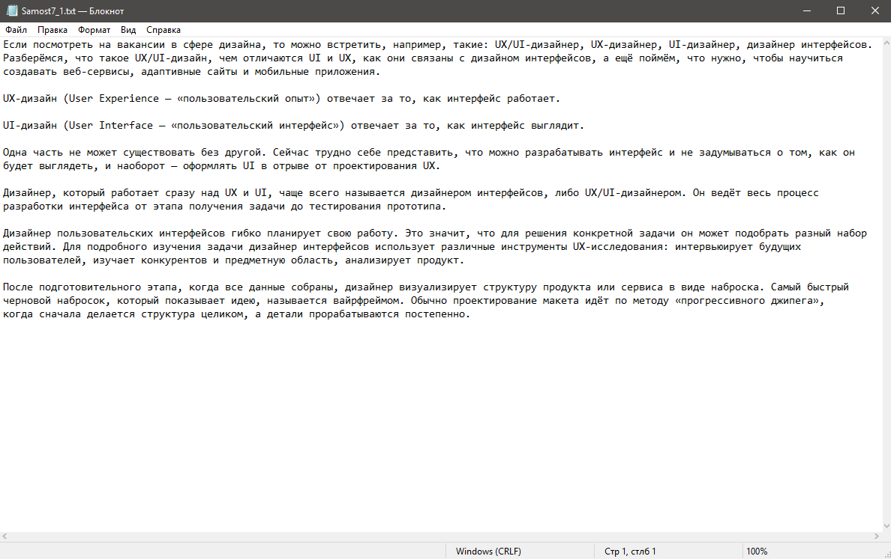
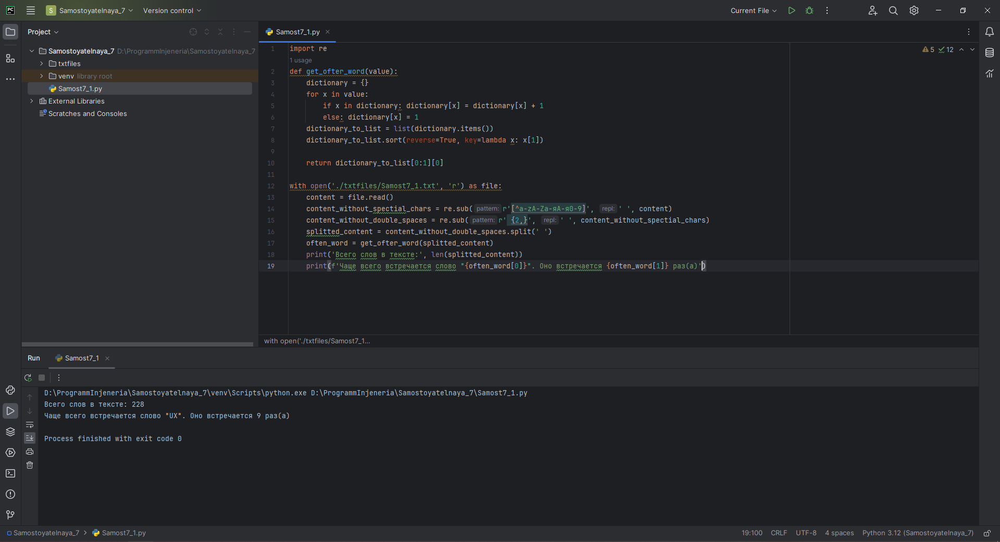
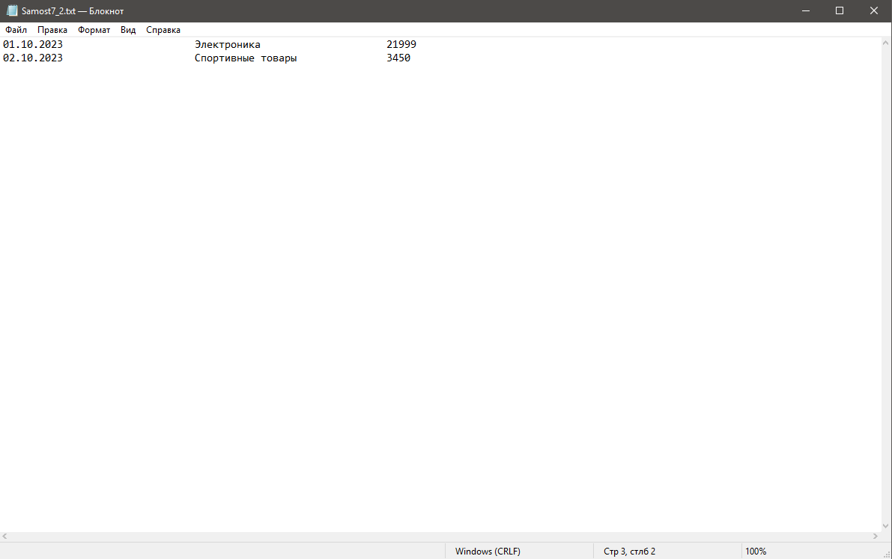
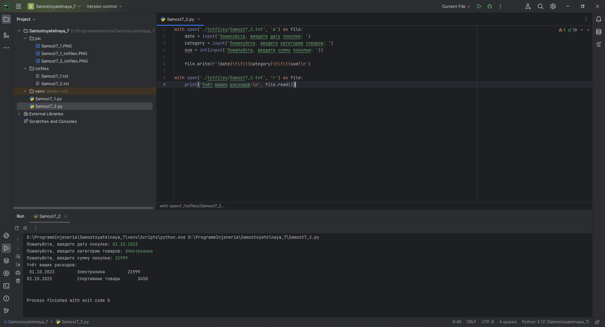

# Тема 7. Работа с файлами (ввод, вывод)
Отчет по Теме #7 выполнил(а):
- Еличкин Владислав Евгеньевич
- ЗПИЭ-20-1

| Задание    | Сам_раб |
|------------|---------|
| Задание 1  |    +    |
| Задание 2  |    +    |
| Задание 3  |    +    |
| Задание 4  |    +    |
| Задание 5  |    +    |

знак "+" - задание выполнено; знак "-" - задание не выполнено;

Работу проверили:
- к.э.н., доцент Панов М.А.

## Самостоятельная работа №1
### Найдите в интернете любую статью (объем статьи не менее 200 слов), скопируйте ее содержимое в файл и напишите программу, которая считает количество слов в текстовом файле и определит самое часто встречающееся слово. Результатом выполнения задачи будет: скриншот файла со статьей, листинг кода, и вывод в консоль, в котором будет указана вся необходимая информация.

```python
import re
def get_ofter_word(value):
    dictionary = {}
    for x in value:
        if x in dictionary: dictionary[x] = dictionary[x] + 1
        else: dictionary[x] = 1
    dictionary_to_list = list(dictionary.items())
    dictionary_to_list.sort(reverse=True, key=lambda x: x[1])

    return dictionary_to_list[0:1][0]

with open('./txtfiles/Samost7_1.txt', 'r') as file:
    content = file.read()
    content_without_spectial_chars = re.sub(r'[^a-zA-Zа-яА-я0-9]', ' ', content)
    content_without_double_spaces = re.sub(r' {2,}', ' ', content_without_spectial_chars)
    splitted_content = content_without_double_spaces.split(' ')
    often_word = get_ofter_word(splitted_content)
    print('Всего слов в тексте:', len(splitted_content))
    print(f'Чаще всего встречается слово "{often_word[0]}". Оно встречается {often_word[1]} раз(а)')
```

### Результат.




## Выводы

В данном задании, с помощью функции `split()` я разбил строку на отдельные слова. После с помощью функции `len()`, рассчитал общее количество слов, и слово, которое встречается чаще всего.

## Самостоятельная работа №2
### У вас появилась потребность в ведении книги расходов, посмотрев все существующие варианты вы пришли к выводу что вас ничего не устраивает и нужно все делать самому. Напишите программу для учета расходов. Программа должна позволять вводить информацию о расходах, сохранять ее в файл и выводить существующие данные в консоль. Ввод информации происходит через консоль. Результатом выполнения задачи будет: скриншот файла с учетом расходов, листинг кода, и вывод в консоль, с демонстрацией работоспособности программы.

```python
with open('./txtfiles/Samost7_2.txt', 'a') as file:
    date = input('Пожалуйста, введите дату покупки: ')
    category = input('Пожалуйста, введите категорию товаров: ')
    sum = int(input('Пожалуйста, введите сумму покупки: '))

    file.write(f'{date}\t\t\t{category}\t\t\t{sum}\n')

with open('./txtfiles/Samost7_2.txt', 'r') as file:
    print('Учёт ваших расходов:\n', file.read())
```

### Результат.




## Выводы

В данном задании, с помощью режима добавления внес новую ифнормацию. После с помощью режима чтения отобразил ранее введенную информацию.
