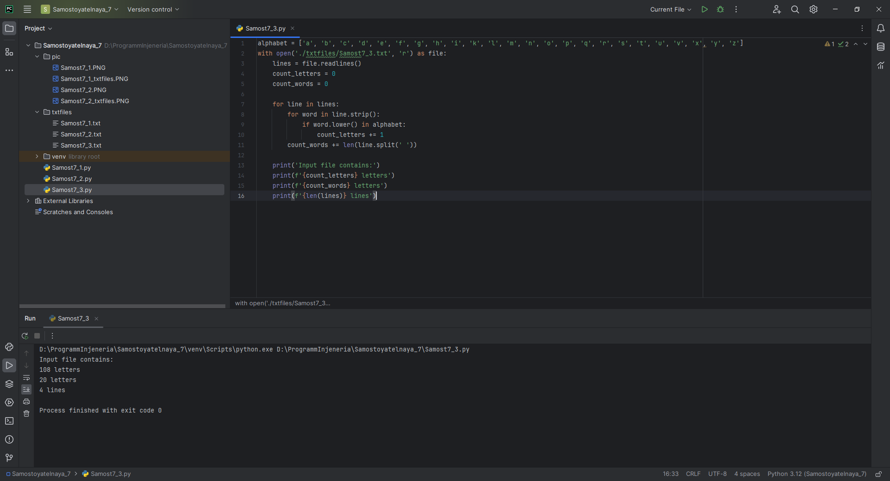
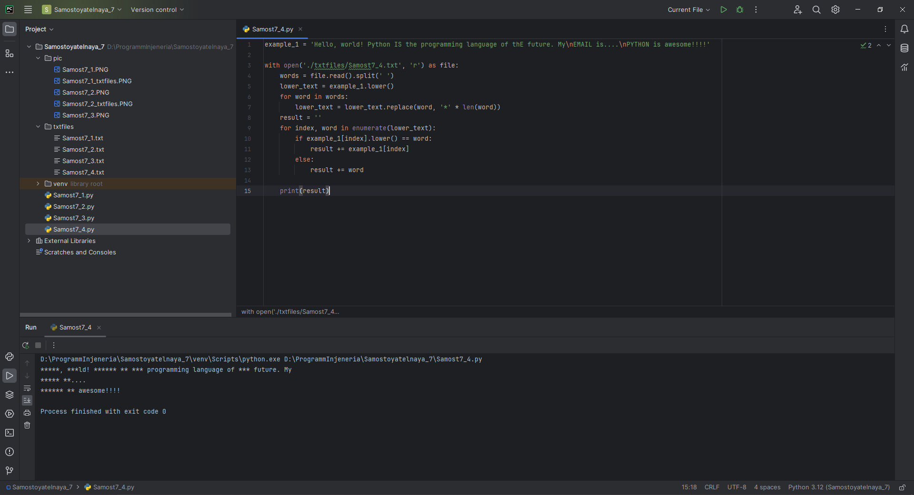
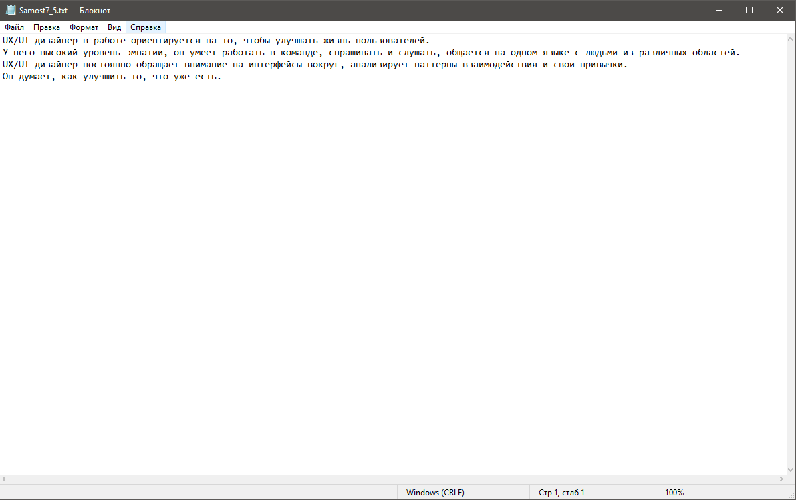
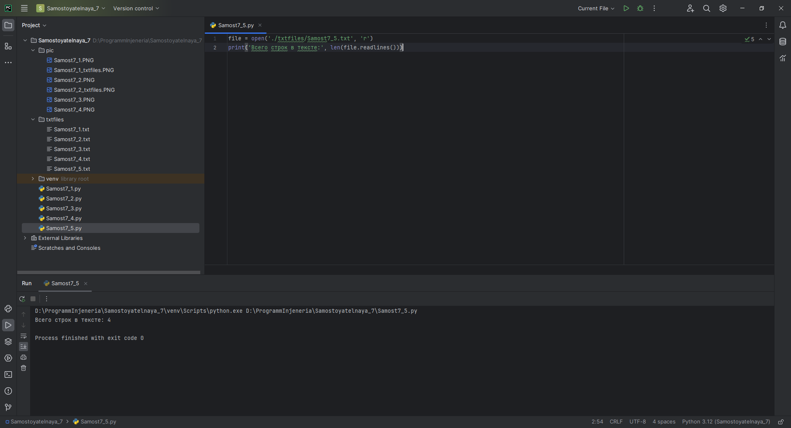

# Тема 7. Работа с файлами (ввод, вывод)
Отчет по Теме #7 выполнил(а):
- Еличкин Владислав Евгеньевич
- ЗПИЭ-20-1

| Задание    | Сам_раб |
|------------|---------|
| Задание 1  |    +    |
| Задание 2  |    +    |
| Задание 3  |    +    |
| Задание 4  |    +    |
| Задание 5  |    +    |

знак "+" - задание выполнено; знак "-" - задание не выполнено;

Работу проверили:
- к.э.н., доцент Панов М.А.

## Самостоятельная работа №1
### Найдите в интернете любую статью (объем статьи не менее 200 слов), скопируйте ее содержимое в файл и напишите программу, которая считает количество слов в текстовом файле и определит самое часто встречающееся слово. Результатом выполнения задачи будет: скриншот файла со статьей, листинг кода, и вывод в консоль, в котором будет указана вся необходимая информация.

```python
import re
def get_ofter_word(value):
    dictionary = {}
    for x in value:
        if x in dictionary: dictionary[x] = dictionary[x] + 1
        else: dictionary[x] = 1
    dictionary_to_list = list(dictionary.items())
    dictionary_to_list.sort(reverse=True, key=lambda x: x[1])

    return dictionary_to_list[0:1][0]

with open('./txtfiles/Samost7_1.txt', 'r') as file:
    content = file.read()
    content_without_spectial_chars = re.sub(r'[^a-zA-Zа-яА-я0-9]', ' ', content)
    content_without_double_spaces = re.sub(r' {2,}', ' ', content_without_spectial_chars)
    splitted_content = content_without_double_spaces.split(' ')
    often_word = get_ofter_word(splitted_content)
    print('Всего слов в тексте:', len(splitted_content))
    print(f'Чаще всего встречается слово "{often_word[0]}". Оно встречается {often_word[1]} раз(а)')
```

### Результат.


## Выводы

В данном задании, с помощью функции `split()` я разбил строку на отдельные слова. После с помощью функции `len()`, рассчитал общее количество слов, и слово, которое встречается чаще всего.

## Самостоятельная работа №2
### У вас появилась потребность в ведении книги расходов, посмотрев все существующие варианты вы пришли к выводу что вас ничего не устраивает и нужно все делать самому. Напишите программу для учета расходов. Программа должна позволять вводить информацию о расходах, сохранять ее в файл и выводить существующие данные в консоль. Ввод информации происходит через консоль. Результатом выполнения задачи будет: скриншот файла с учетом расходов, листинг кода, и вывод в консоль, с демонстрацией работоспособности программы.

```python
with open('./txtfiles/Samost7_2.txt', 'a') as file:
    date = input('Пожалуйста, введите дату покупки: ')
    category = input('Пожалуйста, введите категорию товаров: ')
    sum = int(input('Пожалуйста, введите сумму покупки: '))

    file.write(f'{date}\t\t\t{category}\t\t\t{sum}\n')

with open('./txtfiles/Samost7_2.txt', 'r') as file:
    print('Учёт ваших расходов:\n', file.read())
```

### Результат.


## Выводы

В данном задании, с помощью режима добавления внес новую ифнормацию. После с помощью режима чтения отобразил ранее введенную информацию.

## Самостоятельная работа №3
### Имеется файл input.txt с текстом на латинице. Напишите программу, которая выводит следующую статистику по тексту: количество букв латинского алфавита; число слов; число строк.

```python
alphabet = ['a', 'b', 'c', 'd', 'e', 'f', 'g', 'h', 'i', 'k', 'l', 'm', 'n', 'o', 'p', 'q', 'r', 's', 't', 'u', 'v', 'x', 'y', 'z']
with open('./txtfiles/Samost7_3.txt', 'r') as file:
    lines = file.readlines()
    count_letters = 0
    count_words = 0

    for line in lines:
        for word in line.strip():
            if word.lower() in alphabet:
                count_letters += 1
        count_words += len(line.split(' '))

    print('Input file contains:')
    print(f'{count_letters} letters')
    print(f'{count_words} letters')
    print(f'{len(lines)} lines')
```

### Результат.



## Выводы

В данном задании, я посчитал все слова (с помощью цикла), посчитал все буквы и с помощью функции `len()` посчитал количество строк. 

## Самостоятельная работа №4
### Напишите программу, которая получает на вход предложение, выводит его в терминал, заменяя все запрещенные слова звездочками * (количество звездочек равно количеству букв в слове). Запрещенные слова, разделенные символом пробела, хранятся в текстовом файле input.txt. Все слова в этом файле записаны в нижнем регистре. Программа должна заменить запрещенные слова, где бы они ни встречались, даже в середине другого слова. Замена производится независимо от регистра: если файл input.txt содержит запрещенное слово exam, то слова exam, Exam, ExaM, EXAM и exAm должны быть заменены на ****.

```python
example_1 = 'Hello, world! Python IS the programming language of thE future. My\nEMAIL is....\nPYTHON is awesome!!!!'

with open('./txtfiles/Samost7_4.txt', 'r') as file:
    words = file.read().split(' ')
    lower_text = example_1.lower()
    for word in words:
        lower_text = lower_text.replace(word, '*' * len(word))
    result = ''
    for index, word in enumerate(lower_text):
        if example_1[index].lower() == word:
            result += example_1[index]
        else:
            result += word

    print(result)
```

### Результат.



## Выводы

В данном задании, я преобразовал строку к нижнему регистру и заменил все необходимые слова из условия *. После восстановил регистр символов.

## Самостоятельная работа №5
### Имеется файл с текстом. Необходимо узнать, какое количество строк текста в нем.

```python
file = open('./txtfiles/Samost7_5.txt', 'r')
print('Всего строк в тексте:', len(file.readlines()))
```

### Результат.





## Выводы

В данном задании, сначала читаем данные из файла, потом считаем количество строк в нем.

## Общий вывод по самостоятельной работе №7

С помощью встроенных средств Python можно полноценно работать с файлами: создавать, читать, записывать, считывать, заменять и многое другое. 
