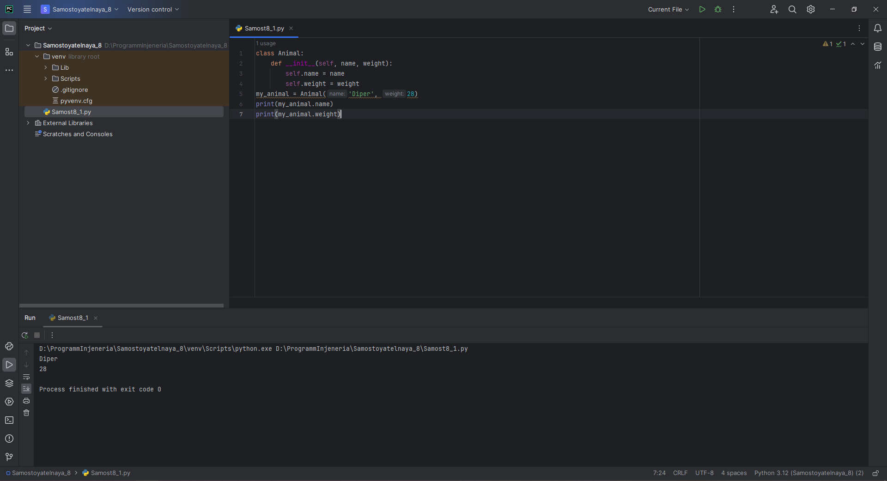
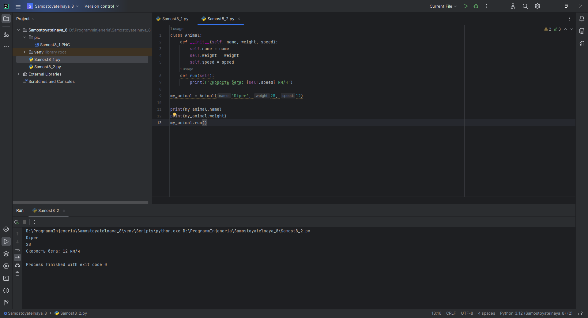
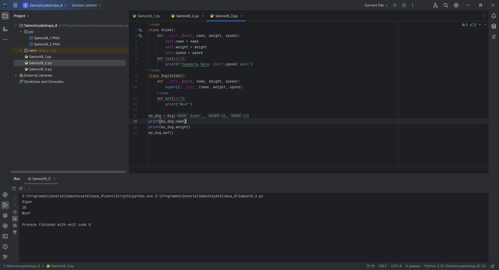
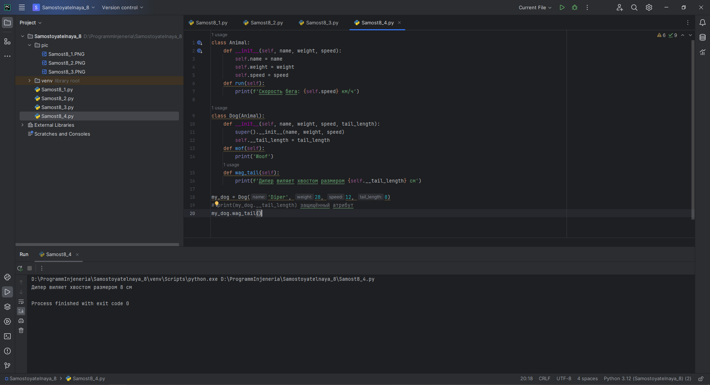
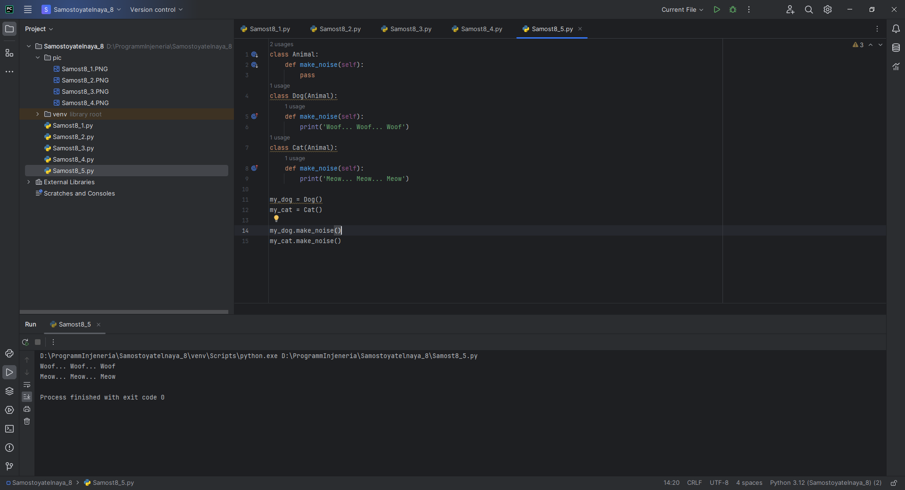

# Тема 8. Введение в ООП
Отчет по Теме #8 выполнил(а):
- Еличкин Владислав Евгеньевич
- ЗПИЭ-20-1

| Задание    | Сам_раб |
|------------|---------|
| Задание 1  |    +    |
| Задание 2  |    +    |
| Задание 3  |    +    |
| Задание 4  |    +    |
| Задание 5  |    +    |

знак "+" - задание выполнено; знак "-" - задание не выполнено;

Работу проверили:
- к.э.н., доцент Панов М.А.

## Самостоятельная работа №1
### Самостоятельно создайте класс и его объект. Они должны отличаться, от тех, что указаны в теоретическом материале (методичке) и лабораторных заданиях. Результатом выполнения задания будет листинг кода и получившийся вывод консоли.

```python
class Animal:
    def __init__(self, name, weight):
        self.name = name
        self.weight = weight
my_animal = Animal('Diper', 28)
print(my_animal.name)
print(my_animal.weight)
```

### Результат.



## Выводы

Идея класса является одной из основополагающих концепций ООП. В этом задании я в этом убедился.

## Самостоятельная работа №2
### Самостоятельно создайте атрибуты и методы для ранее созданного класса. Они должны отличаться, от тех, что указаны в теоретическом материале (методичке) и лабораторных заданиях. Результатом выполнения задания будет листинг кода и получившийся вывод консоли.

```python
class Animal:
    def __init__(self, name, weight, speed):
        self.name = name
        self.weight = weight
        self.speed = speed
    def run(self):
        print(f'Скорость бега: {self.speed} км/ч')

my_animal = Animal('Diper', 28, 12)

print(my_animal.name)
print(my_animal.weight)
my_animal.run()
```

### Результат.



## Выводы

Для ранее созданного класса, я добавил атрибуты speed и run, которые сообщают о скорости перемещения.

## Самостоятельная работа №3
### Самостоятельно реализуйте наследование, продолжая работать с ранее созданным классом. Оно должно отличаться, от того, что указано в теоретическом материале (методичке) и лабораторных заданиях. Результатом выполнения задания будет листинг кода и получившийся вывод консоли.

```python
class Animal:
    def __init__(self, name, weight, speed):
        self.name = name
        self.weight = weight
        self.speed = speed
    def run(self):
        print(f'Скорость бега: {self.speed} км/ч')
class Dog(Animal):
    def __init__(self, name, weight, speed):
        super().__init__(name, weight, speed)
    def wof(self):
        print('Woof')

my_dog = Dog('Diper', 28, 12)
print(my_dog.name)
print(my_dog.weight)
my_dog.wof()
```

### Результат.



## Выводы

Одним из ключевых инструментов объектно-ориентированного программирования (ООП) является наследование. Наследование используется для определения нового класса, который наследует атрибуты и методы существующего класса. 

## Самостоятельная работа №4
### Самостоятельно реализуйте инкапсуляцию, продолжая работать с ранее созданным классом. Она должна отличаться, от того, что указана в теоретическом материале (методичке) и лабораторных заданиях. Результатом выполнения задания будет листинг кода и получившийся вывод консоли.

```python
class Animal:
    def __init__(self, name, weight, speed):
        self.name = name
        self.weight = weight
        self.speed = speed
    def run(self):
        print(f'Скорость бега: {self.speed} км/ч')

class Dog(Animal):
    def __init__(self, name, weight, speed, tail_length):
        super().__init__(name, weight, speed)
        self.__tail_length = tail_length
    def wof(self):
        print('Woof')
    def wag_tail(self):
        print(f'Дипер виляет хвостом размером {self.__tail_length} см')

my_dog = Dog('Diper', 28, 12, 8)
# print(my_dog.__tail_length) защищённый атрибут
my_dog.wag_tail()
```

### Результат.



## Выводы

В Python можно достичь инкапсуляции, используя модификаторы доступа для управления видимостью атрибутов и методов. Это помогает предотвратить непреднамеренные изменения или доступ к конфиденциальным данным.

## Самостоятельная работа №5
### Самостоятельно реализуйте полиморфизм. Он должен отличаться, от того, что указан в теоретическом материале (методичке) и лабораторных заданиях. Результатом выполнения задания будет листинг кода и получившийся вывод консоли.

```python
class Animal:
    def make_noise(self):
        pass
class Dog(Animal):
    def make_noise(self):
        print('Woof... Woof... Woof')
class Cat(Animal):
    def make_noise(self):
        print('Meow... Meow... Meow')

my_dog = Dog()
my_cat = Cat()

my_dog.make_noise()
my_cat.make_noise()
```

### Результат.



## Выводы

Полиморфизм в объектно-ориентированном программировании означает способность объектов разных классов использовать одно и то же имя метода, но с различной реализацией. Это позволяет обрабатывать различные типы данных с использованием общих интерфейсов.

## Общий вывод по самостоятельной работе №8

Python поддерживает классы, что позволяет писать код в парадигме ООП.
