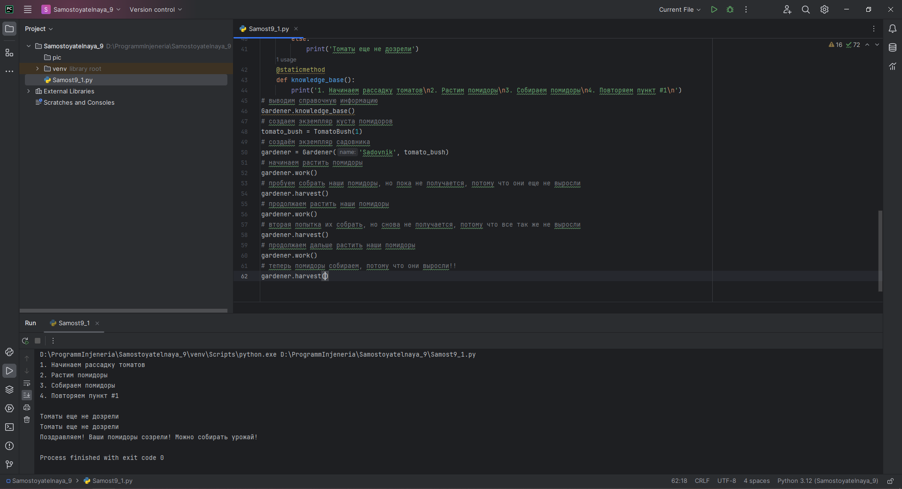

# Тема 9. Концепции и принципы ООП
Отчет по Теме #9 выполнил(а):
- Еличкин Владислав Евгеньевич
- ЗПИЭ-20-1

| Задание    | Сам_раб |
|------------|---------|
| Задание 1  |    +    |

знак "+" - задание выполнено; знак "-" - задание не выполнено;

Работу проверили:
- к.э.н., доцент Панов М.А.

## Самостоятельная работа №1
### Задание Садовник и помидоры.

```python
class Tomato:
    states = ['none', 'growing', 'greed', 'red']
    def __init__(self, index):
        self._index = index # защищённый аттрибут
        self._state = Tomato.states[0] # защищённый аттрибут
    def grow(self):
        current_index = Tomato.states.index(self._state)
        if len(Tomato.states) - 1 > current_index:
            self._state = Tomato.states[current_index + 1]
        else:
            print('Дальше расти некуда')
    def is_ripe(self):
        return self._state == Tomato.states[-1]
class TomatoBush:
    def __init__(self, count_tomatoes):
        tomatoes = []
        for i in range(count_tomatoes):
            tomatoes.append(Tomato(i))
        self.tomatoes = tomatoes
    def grow_all(self):
        for tomato in self.tomatoes:
            tomato.grow()
    def all_are_ripe(self):
        for i in self.tomatoes:
            if not i.is_ripe():
                return False
        return True
    def give_away_all(self):
        self.tomatoes.clear()
class Gardener:
    def __init__(self, name, plant):
        self.name = name # публичный аттрибут
        self._plant = plant # защищённый аттрибут
    def work(self):
        self._plant.grow_all()
    def harvest(self):
        if self._plant.all_are_ripe():
            print('Поздравляем! Ваши помидоры созрели! Можно собирать урожай!')
            self._plant.give_away_all()
        else:
            print('Томаты еще не дозрели')
    @staticmethod
    def knowledge_base():
        print('1. Начинаем рассадку томатов\n2. Растим помидоры\n3. Собираем помидоры\n4. Повторяем пункт #1\n')
# выводим справочную информацию
Gardener.knowledge_base()
# создаем экземпляр куста помидоров
tomato_bush = TomatoBush(1)
# создаём экземпляр садовника
gardener = Gardener('Sadovnik', tomato_bush)
# начинаем растить помидоры
gardener.work()
# пробуем собрать наши помидоры, но пока не получается, потому что они еще не выросли
gardener.harvest()
# продолжаем растить наши помидоры
gardener.work()
# вторая попытка их собрать, но снова не получается, потому что все так же не выросли
gardener.harvest()
# продолжаем дальше растить наши помидоры
gardener.work()
# теперь помидоры собираем, потому что они выросли!!
gardener.harvest()
```

### Результат.



## Выводы

В среде программирования Python существуют разные принципы, подходы и стратегии, позволяющие составлять код в рамках заданного проекта. Объектно-ориентированное программирование (ООП) – это как раз одна из существующих парадигм.

## Общий вывод по самостоятельной работе №9

Объектно-ориентированное программирование (ООП) – парадигма программного кода, в которой центральную роль занимают объекты и данные. Концепция помогает разделить приложение на логические блоки, которые можно разрабатывать и поддерживать.
